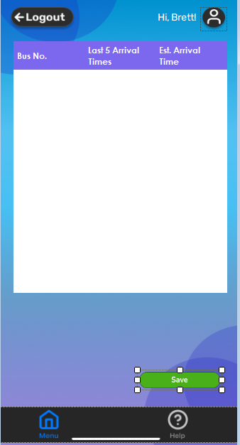

# Bus_Logger_Application

This is a Windows Forms application I developed in 2023 as part of my Grade 12 school project. The **Bus Logger Application** is designed to help users efficiently log and manage bus schedule data. It features data entry forms, XML-based storage for persistence, and functionality to retrieve and display stored records.

---

## 🛠️ Features

- Data entry interface for bus logs
- XML file-based data storage and retrieval
- Record display and basic search functionality
- Input validation and error handling
- Simple and intuitive UI using Windows Forms

---

## 🧠 What I Learned

- C# programming and WinForms UI design
- Working with XML files for data serialization
- Application debugging and input validation
- Real-world application structure and project management
- Foundations for future development and design principles

---

## 📸 Screenshots

### User Interfaces

  

### Data Entry Example

### Examples of Code

